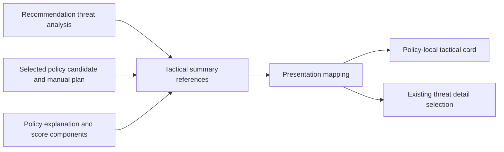

# Loadout comparison tactical explanation

| Field | Value |
|---|---|
| Status | Accepted |
| Scope | Policy-local threat coverage, requirements, risks, and scores |
| Backlog | E4-006 |
| Last updated | 2026-08-08 |

## Purpose

The comparison explains the verified tactical facts attached to each Safe,
Balanced, and Aggressive winner. It does not evaluate a second set of combat
rules in Presentation, estimate an outcome, or turn unsupported effect prose
into coverage.

The comparison contract and normalization remain defined by
[the comparison contract](./LOADOUT-COMPARISON-CONTRACT.md) and
[the comparison builder](./LOADOUT-COMPARISON-BUILDER.md). This document
defines how their tactical references reach the UI.

## Authoritative fact path

`CombatLoadoutComparisonBuilder` projects facts already produced for the
policy winner:

- covered threats are exactly the selected candidate's typed `ThreatCodes`;
- unresolved threats are the typed threat-analysis codes not present in that
  covered set;
- active defense and agility come from the selected manual plan;
- condition and caveat references come from the policy explanation;
- score kind, weight, value or unavailable reason, explanation, and evidence
  reference come from the winning candidate's existing score components; and
- the aggregate evidence list is copied from the recommendation, policy
  result, and manual plan.

Only explicit candidate threat codes can establish coverage. Raw effect text,
an evidence reference by itself, or an unsupported target mechanic cannot add
a covered threat.

## Presentation projection

`CombatRecommendationViewModelMapper` resolves every tactical threat reference
against the already-mapped typed threat list. A missing reference fails the
mapping instead of inventing a title or severity. Conditions and caveats are
copied from the same policy explanation that supplied their comparison
references, retaining their typed kind, status or criticality, explanation,
and evidence references. Skill identities are resolved to player-facing names.

Critical or unverified recommendation warnings are copied into the comparison
as unsupported mechanics. They remain visibly separate from verified covered
threats and from scoring.

The UI displays evidence counts and makes covered and unresolved threat facts
selectable through the existing threat-detail interaction. Internal evidence
references remain available in the presentation model for correlation and
tests but are not exposed as technical identifiers in player-facing text.

## Policy and score boundary

Every policy card shows its own roles, covered threats, unresolved risks,
conditions, caveats, and score components. Score rows preserve the original
component weight, available score or safe unavailable reason, explanation,
and evidence reference. The cards do not calculate or render a cross-policy
total, universal winner, or win probability. Visible copy states that the
scores rank candidates only within their originating policy.

The all-rows versus differences-only filter applies only to loadout rows. The
tactical section is outside that filter, so unresolved critical risks,
requirements, caveats, and unsupported mechanics cannot disappear when a
player asks to see differences only. Narrow layouts show the selected policy's
complete tactical card; changing the policy reveals another already-mapped
card without recomputation.

## Safety and localization

Threat buttons change helper-local focus only. The tactical section exposes no
save write, game control, equip, redirection, breakthrough, process, or
screenshot operation. Architecture tests allow-list only that read-only focus
event and continue to reject mutation-capable Presentation dependencies.

All fixed labels and the synthetic unavailable, requirement, caveat, warning,
and score explanations used by rendering tests have Traditional Chinese
translations. Codes remain visible beside localized titles because the
acceptance contract requires both verified codes and titles.

## Verification

Focused verification on 2026-08-08 passed:

- Application tests: 135/135;
- API/presentation tests: 256/256; and
- architecture tests: 79/79.

The Application test `Tactical_summary_retains_policy_local_facts` proves that
coverage, action counts, score component order, and weights remain those of
each policy winner. Mapper tests prove all policy columns retain threat
partitioning, evidence, weights, and explanations. Rendering tests cover
identical and distinct coverage, critical unresolved risks in differences-only
mode, unsupported mechanics, manual conditions, caveats, unavailable score
evidence, policy-local score language, selectable threat facts, and bilingual
output without rendering internal evidence references.
