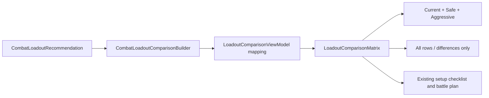

# Loadout comparison presentation

| Field | Value |
|---|---|
| Status | Accepted |
| Scope | Combat recommendation presentation and Blazor UI |
| Backlog | E4-004 |
| Last updated | 2026-08-09 |

## Purpose

The combat recommendation page projects Current, Safe, and Aggressive from the
complete typed Current/Safe/Balanced/Aggressive result produced from one
immutable snapshot.
The matrix is an inspection and manual-planning surface. It never recalculates
feasibility, changes recommendation facts, or controls the game.

The authoritative comparison semantics are defined by
[the loadout comparison contract](./LOADOUT-COMPARISON-CONTRACT.md). The
Application normalization is described by
[the comparison builder](./LOADOUT-COMPARISON-BUILDER.md), and the public
transport shape is described by
[the comparison API](./LOADOUT-COMPARISON-API.md). Policy-local threat,
requirement, risk, and score projection is described by
[the tactical explanation](./LOADOUT-COMPARISON-EXPLANATION.md).

## Presentation flow

`CombatRecommendationViewModelMapper` builds the comparison once and maps it
to presentation-only records. Razor consumes those records and does not read
save adapters, inspect domain candidates, or infer missing values. Stable skill
IDs correlate rows internally; only resolved names are rendered.

## Matrix structure

- Typed columns remain in Current, Safe, Balanced, Aggressive order; the review
  UI projects Current, Safe, Aggressive.
- Category groups remain in 內功, 摧破, 輕靈, 護體, 奇竅 order.
- Each category header reports used capacity, total capacity, remaining
  capacity, and the effective 萬用 contribution when available.
- Each skill cell reports membership text plus an icon, effective cost, and
  any required direction or breakthrough action.
- Current provenance groups fields that share the same source and capture time.
- An infeasible policy renders its diagnostic instead of an invented loadout
  or zero-valued capacity.
- Unavailable fields render an explicit unavailable state and preserve their
  player-safe reason where one exists.

The desktop table has a fixed comparison canvas inside a keyboard-focusable
horizontal scroll region. Below 1280 CSS pixels, responsive classes hide the
unselected visible policy column and retain Current plus the policy selected by
the page-level Safe/Aggressive button group. All four typed columns remain in
the immutable view model; Presentation omits Balanced and responsive CSS hides
the unselected visible policy without rebuilding or rereading the result.

## Interaction state

`LoadoutComparisonFilterState` owns only the helper-local all-rows versus
differences-only choice. Differences are based on typed membership and manual
actions, so filtering cannot hide an action the player must perform. A new
comparison reference resets the filter; changing the selected policy within
one comparison does not. Desktop counts consider every visible policy, while
narrow counts and CSS row visibility consider only the selected policy.

`RecommendationSelectionState` owns the selected policy shared by the matrix,
setup checklist, and battle plan. It starts with the requested policy when
feasible, otherwise the first feasible policy, otherwise Safe. One page-level
native button group changes that state for the matrix and downstream details.

Policy links invoke the existing recommendation selection state and target the
existing manual checklist heading. The selected checklist and battle plan
therefore come from the same policy result as the chosen matrix column.

The selected policy's tactical card remains outside the row-difference filter.
It keeps the winner's covered and unresolved threats, requirements, caveats,
and score components visible without duplicating an unselected card or
producing a cross-policy total. Threat
facts select the existing target-analysis detail; they do not trigger a new
read or recommendation.

## Accessibility and localization

Category links follow canonical order and target focusable row-group headings.
A focus-revealed skip link reaches the first category. Column headers use
`scope="col"`, category headers use `scope="rowgroup"`, and skill headers use
`scope="row"`. Every skill and capacity cell has a localized accessible label
containing its name/category, column, state, values, actions, and safe
unavailable information.

Text and icons jointly convey membership and action states. Long names,
diagnostics, and unavailable reasons use wrapping instead of ellipsis. Policy
and filter announcements are polite live regions with desktop and selected-
policy narrow row counts.

All comparison labels and the persistent non-interference notice use
`UiText`. Pattern-based localization covers policy-specific unavailable and
no-feasible-result diagnostics. Practice directions and resolved entity names
remain player-facing rather than exposing enum values or technical IDs.

## Atomic page states

The page removes the complete recommendation model before a recommendation or
target-observation refresh starts. Loading, failure, target change, and cleared
observation states therefore cannot leave a stale matrix beside a newer page
notice. A successful response maps and installs the recommendation, comparison,
selection state, and page state together.

## Safety boundary

The matrix exposes no execute, equip, apply-to-game, save-write, or automation
operation. Its controls change only helper-owned presentation state or select
an already-built policy. The visible information-only notice states that the
player must perform every direction, breakthrough, and loadout change manually
in the game.

The architecture event-handler allow-list covers the policy buttons, the two filter handlers, and
the policy-selection handler as read-only or helper-local operations. Existing
forbidden file-write and game-control checks continue to scan all Presentation
source.

## Verification

Presentation mapper and render tests cover:

- four columns from one snapshot and all five stable categories;
- feasible, partially infeasible, unchanged, changed, and unavailable cells;
- capacity, 萬用, provenance, diagnostic, legend, and information-only text;
- differences-only filtering with required manual actions retained; and
- links from available policies to the existing checklist and battle plan.
