# Current recommendation-system flow

Last reviewed: 2026-08-02  
Branch: `sprint-1/epic/taiwu-helper`  
Commit: `1c65bfe`

```mermaid
flowchart TD
    A{"Recommendation entry point"}

    A -->|Blazor UI| B["Search save for target<br/>select target and objective"]
    A -->|REST API| C["POST /api/combat-recommendations<br/>target ID, objective, optional screen observation"]

    B --> D["RecommendCombatLoadout"]
    C --> D

    D --> E["Read save in read-only mode<br/>player, target, skills, costs, directions,<br/>effect IDs, slots and inner-power state"]

    E --> F{"Is a newer current-screen<br/>observation supplied?"}
    F -->|Yes| G["Override observed loadout,<br/>generic allocation and optional slot budgets"]
    F -->|No| H["Use save snapshot"]
    G --> I
    H --> I

    I{"Does GameData version match<br/>the verified catalogue?"}
    I -->|Yes| J["Analyze equipped and learned target skills<br/>using GoldenMagicSound threat rules"]
    I -->|No| K["Produce no verified threats<br/>and preserve a version warning"]

    J --> L["Build curated option pool<br/>verified counters matching threats<br/>+ currently equipped skills to retain"]
    K --> L

    L --> M["Hard-filter every option<br/>ownership and mastery<br/>direction or achievable breakthrough<br/>exact effect ID<br/>no active-use inner-power backlash"]

    M -->|Rejected| N["Record rejection diagnostic<br/>some equipped skills may fall back<br/>to retain-only options"]
    M -->|Accepted| O["Eligible option pool"]
    N -.-> O

    O --> P["Bounded combination search<br/>include/exclude strategic counters<br/>then greedily retain current skills"]

    P --> Q{"At most one active agility<br/>and one active defense?"}
    Q -->|No| R["Discard combination<br/>record diagnostic"]
    Q -->|Yes| S["Optimize learned Neigong<br/>within the fixed six-slot budget"]

    S --> T["Derive outer-category capacities<br/>and allocate generic slots"]
    T --> U{"Complete feasibility check<br/>requirements, directions, costs,<br/>slot budgets and category consistency"}

    U -->|Failed| V["Discard combination<br/>record feasibility failures"]
    U -->|Passed| W["Keep feasible candidate"]

    W --> X["After bounded search:<br/>deduplicate, deterministically order<br/>and apply result limit"]

    X --> Y{"Any feasible candidates?"}
    Y -->|No| Z["Return no manual plan<br/>with warnings and diagnostics"]
    Y -->|Yes| AA["Score every candidate separately for<br/>Safe, Balanced and Aggressive"]

    AA --> AB["Eight score components<br/>threat coverage · survival · reliability<br/>current-loadout compatibility · damage evidence<br/>unused capacity · conditional risk · inner power"]

    AB --> AC["Rank by total score<br/>then coverage, retention and stable key"]
    AC --> AD["Select the top candidate for each style"]

    AD --> AE["Build manual plan<br/>remove · breakthrough · add<br/>change direction · retain"]
    AE --> AF["Build battle opening,<br/>active-role alternatives and switching conditions"]
    AF --> AG["Build structured explanations<br/>evidence, costs, threats, conditions and caveats"]

    AG --> AH["Mark the requested style as selected<br/>while retaining all three styles"]
    Z --> AI
    AH --> AI["Map to UI view model or API response"]

    R -. diagnostics .-> AI
    V -. diagnostics .-> AI
    K -. warnings .-> AI

    AI --> AJ["Display information only<br/>never alter the save or control the game"]
```

## Current boundaries

- Threat and counter detection is limited to the exact-version
  `GoldenMagicSound` catalogue. It is not yet a general-purpose enemy model.
- Invalid options and combinations are removed before scoring rather than
  receiving lower scores.
- Every run calculates the Safe, Balanced and Aggressive styles. The requested
  objective determines which style is selected for display.
- The current use case does not supply damage evidence. Damage potential is
  therefore marked unavailable and excluded from the normalized score.
- The output is a manual, information-only plan. The helper does not equip
  skills, control the game, or modify the save.

## Primary implementation references

- [`RecommendCombatLoadout.cs`](../../src/TaiWu.Application/CombatRecommendations/RecommendCombatLoadout.cs)
- [`TargetThreatAnalyzer.cs`](../../src/TaiWu.Domain/CombatThreats/TargetThreatAnalyzer.cs)
- [`VerifiedTargetThreatRuleSets.cs`](../../src/TaiWu.Domain/CombatThreats/VerifiedTargetThreatRuleSets.cs)
- [`CombatLoadoutGenerator.cs`](../../src/TaiWu.Domain/CombatRecommendations/CombatLoadoutGenerator.cs)
- [`NeigongLoadoutOptimizer.cs`](../../src/TaiWu.Domain/CombatRecommendations/NeigongLoadoutOptimizer.cs)
- [`CombatLoadoutFeasibilityValidator.cs`](../../src/TaiWu.Domain/CombatSnapshots/CombatLoadoutFeasibilityValidator.cs)
- [`CombatRecommendationScorer.cs`](../../src/TaiWu.Domain/CombatRecommendations/CombatRecommendationScorer.cs)
- [`ManualCombatPlanBuilder.cs`](../../src/TaiWu.Domain/CombatRecommendations/ManualCombatPlanBuilder.cs)
- [`CombatRecommendationExplanationBuilder.cs`](../../src/TaiWu.Domain/CombatRecommendations/CombatRecommendationExplanationBuilder.cs)
- [`TaiwuArchiveReadSession.cs`](../../src/TaiWu.Infrastructure/SaveGames/TaiwuArchiveReadSession.cs)
