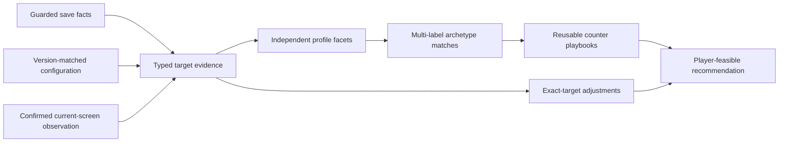

# Target combat-profile evidence boundary

This document defines the evidence boundary selected by
[E5-000](../roadmap/epic-005/BACKLOG.md#e5-000--verify-target-profile-signals-and-select-the-representative-matrix).
It records which facts may become profile facets, which sources own them, and
which tempting interpretations remain unsupported. E5-001 adds the immutable
Domain contract that preserves this boundary before extraction and matching
are implemented.

The supported GameData product version is
`1.0.0+68032f25c1d54dd4fb8fc65b7156e95bf87ec99a`. Every rule in this document
is invalid for a different version until the evidence gate is repeated.

## Decision

Epic 5 starts with four independently matchable playbook families:

1. the existing magic-sound, distraction-mark, mind-resonance, and
   defeat-reset baseline;
2. configured outer-damage pressure on a positively identified active attack;
3. positive, unequal base outer/inner resistance values; and
4. configured poison application on a positively identified active attack.

The new families use exact predicates, not adjectives such as `High` or
`Low`. No percentile, population rank, target-name heuristic, or weapon-label
heuristic is part of the first rule set. A target can match any combination of
these families.

Weapon subtype is retained as descriptive attack context. It never proves a
damage channel, penetration level, defense, poison mechanic, control mechanic,
or counter by itself.

## Domain contract

E5-001 implements the presentation-neutral contract in
`TaiWu.Domain.TargetProfiles`. It has no Application, Infrastructure, API,
filesystem, process, persistence, or GameData dependency.

| Type | Responsibility |
|---|---|
| `TargetCombatProfile` | Owns target identity, profile-rule version, canonical facets, canonical diagnostics, and the deterministic SHA-256 fingerprint |
| `TargetProfileFacetIdentity` | Combines one independent dimension with a stable non-localized facet code |
| `TargetProfileFacet` | Enforces confirmed, incomplete, unsupported, or conflicting state invariants |
| `TargetProfileFacetValue` | Carries either exact mechanic presence or one or more typed positive measurements |
| `TargetProfileMeasurement` | Binds a stable component code to a positive integer and stable raw-unit code |
| `TargetProfileEvidence` | Binds an opaque evidence reference to typed provenance, stable source identity, and exact source version |
| `TargetProfileConflictCandidate` | Retains one typed candidate value and its own evidence rather than selecting a silent winner |
| `TargetProfileUnavailableReason` | Carries a stable reason code and optional explanatory detail |
| `TargetProfileDiagnostic` | Carries stable severity, code, optional facet reference, and evidence references without presentation copy |

### Dimensions

`TargetProfileDimension` contains five independent axes in canonical order:

1. `AttackFamily`;
2. `Pressure`;
3. `Resilience`;
4. `Control`; and
5. `Tempo`.

A facet identity belongs to exactly one dimension. The value supplied to a
confirmed or conflicting facet must repeat the same dimension and facet code;
mixing an attack-family value into a pressure facet fails construction.

### Evidence-state invariants

| State | Authoritative value | Evidence | Conflict candidates | Unavailable reason |
|---|---|---|---|---|
| `Confirmed` | Exactly one compatible typed value | One or more unique entries | Forbidden | Forbidden |
| `Incomplete` | Forbidden | One or more unique entries showing the partial fact or attempted source | Forbidden | Required |
| `Unsupported` | Forbidden | One or more unique entries identifying the unsupported source/rule | Forbidden | Required |
| `Conflicting` | Forbidden | Derived from the candidate evidence | At least two distinct, compatible typed values, each with evidence | Required |

This makes a single value impossible when evidence is missing or conflicting.
Confirmed numeric measurements must be greater than zero; E5-001 therefore
cannot silently turn missing data into a confirmed zero. A future mechanic
with a meaningful zero needs a separate typed value contract and evidence
revision.

### Stable identities and versions

Facet codes, evidence references, source identities, measurement/unit codes,
reason codes, and diagnostic codes use restricted stable tokens. They cannot
contain localized text, whitespace, `/`, or `\`. Versions use a restricted
version token that accepts the installed GameData product version while
rejecting local paths. Blank tokens, invalid enum values, and incompatible
values fail immediately.

Explanatory unavailable detail is deliberately separate from the stable reason
code. It may help a later presentation layer, but cannot alter profile identity.

### Immutability and canonical order

All incoming facet, evidence, measurement, conflict-candidate, diagnostic, and
evidence-reference enumerables are copied. Caller mutation cannot change the
constructed model.

Collections are canonicalized with ordinal stable keys:

- facets by dimension, then facet code;
- measurements by component code;
- evidence by provenance, source identity, version, and reference;
- conflict candidates by typed value and evidence; and
- diagnostics by severity, code, facet, and evidence references.

Duplicate facets, measurements, evidence, conflict values, diagnostics, and
diagnostic evidence references fail construction instead of being discarded.
An empty profile is valid because zero confirmed facets is a meaningful result.

### Profile fingerprint

`TargetCombatProfile.Fingerprint` is an uppercase SHA-256 over a length-prefixed
canonical representation containing:

- fingerprint-schema marker;
- target character ID;
- profile-rule version;
- canonical facet identities, states, typed values, evidence, conflicts, and
  stable unavailable-reason codes; and
- canonical diagnostic facts.

Length-prefix encoding prevents delimiter ambiguity in stable source
identities and evidence references. Reordering any input collection produces
the same fingerprint. Changing the target, rule version, facet, evidence,
conflict, or diagnostic fact changes it.

The model has no display-name, localized-title, timestamp, or path property.
Optional unavailable detail—including local diagnostic text—is excluded from
the fingerprint. Mutable input references are never retained.

## Snapshot projection and extraction

E5-003 extends the immutable combat snapshot with only the raw facts approved
by E5-000:

| Snapshot fact | Type | Infrastructure source | Boundary |
|---|---|---|---|
| Configured outer-damage presence | `CombatSkillSnapshot.HasConfiguredOuterDamage` as `SnapshotValue<bool>` | Positive entry in version-matched `CombatSkillItem.OuterDamageSteps` | Static skill definition only; never proves active use |
| Configured poison-application presence | `CombatSkillSnapshot.HasConfiguredPoisonApplication` as `SnapshotValue<bool>` | Non-zero version-matched `CombatSkillItem.Poisons` | Static skill definition only; no poison type, rate, stack, duration, or severity claim |
| Weapon subtype | `EquipmentSnapshot.ItemSubtype` as `SnapshotValue<int>` | Positive `WeaponItem.ItemSubType` joined through saved equipment | Descriptive attack-family context only |
| Base channel resistance | `TargetCombatSnapshot.BaseChannelResistance` | Standalone-safe `Character.GetBasePenetrationResists()` | Available only when both raw base values are positive; explicitly not live-modified resistance |

Legacy and synthetic snapshots may leave these values unavailable. Optional
constructor parameters preserve compatibility without substituting `false` or
zero.

The Infrastructure reader never calls the unsafe live penetration, resistance,
attack-tendency, recovery, or special-effect paths. A failed or non-positive
base-resistance read becomes unavailable with a warning.

### Versioned extraction rules

`VerifiedTargetProfileExtractionRuleSets.Initial` is bound to:

| Field | Value |
|---|---|
| Profile rule | `E5.PROFILE.1` |
| GameData | `1.0.0+68032f25c1d54dd4fb8fc65b7156e95bf87ec99a` |
| Pressure facet | `OUTER_DAMAGE_CONFIGURED` |
| Resilience facet | `CHANNEL_RESISTANCE_ASYMMETRY` |
| Control facet | `POISON_APPLICATION_CONFIGURED` |
| Attack-family prefix | `WEAPON_SUBTYPE:<positive subtype>` |

It also maps the existing typed `MindDamagePressure`,
`DistractionMarkAccumulation`, `MindResonanceCascade`, and `DefeatMarkReset`
threat kinds to independent profile facets. It does not interpret a raw effect
ID or threat description.

Any unavailable or different GameData version produces an empty profile with a
typed error diagnostic. Extraction does not use nearby versions or retain a
subset of facets.

### Active-skill binding

Static skill facts affect a profile only after an active binding is established:

1. accepted current-screen observed membership or battle-visible active effect;
2. otherwise positive saved equipped membership; and
3. never learned membership alone.

A complete current-screen observation replaces saved active membership. A
partial sparring, hostile, or story observation adds only its positively
observed skills and retains saved positive membership. When the same skill is
present in both, current-screen provenance wins for that binding.

The binding and static definition contribute separate evidence entries. An
active attack with an unavailable static flag creates an incomplete facet. A
missing saved loadout with no accepted observation also creates incomplete
outer-damage and poison facets rather than zero, false, or a negative match.

### Exact facet extraction

- A positively bound attack with `HasConfiguredOuterDamage == true` confirms
  `OUTER_DAMAGE_CONFIGURED`.
- A positively bound attack with
  `HasConfiguredPoisonApplication == true` confirms
  `POISON_APPLICATION_CONFIGURED`.
- Positive unequal base outer/inner resistance confirms
  `CHANNEL_RESISTANCE_ASYMMETRY` with typed `OUTER` and `INNER` measurements.
- Equal positive resistance produces no asymmetry facet. Unavailable or
  non-positive evidence never becomes a confirmed measurement.
- Each positively equipped weapon subtype creates an independent descriptive
  `AttackFamily` facet. It emits no pressure, resilience, control, or tempo
  facet.
- A typed threat facet is confirmed only when at least one threat source is
  equipped or battle-visible. `LearnedUnequipped` threat sources remain a
  diagnostic and never create a facet.

### Observation lifecycle and diagnostics

Extraction consumes the already accepted immutable target observation on the
snapshot. It does not implement competing freshness or merge rules.

Epic 3 warnings for stale, partial, unsupported, precedence-confirmed, and
save-conflicting observations are retained as typed profile diagnostics. A
complete observation/save conflict therefore changes the profile source and
remains explainable. Reapplying the same observation produces the same profile
fingerprint; clearing it and reusing the original save snapshot reproduces the
save-only fingerprint.

### Analysis boundary

`TargetCombatProfileAnalyzer.Analyze` performs one pure sequence:

1. analyze typed target threats from the immutable snapshot;
2. extract the versioned target profile;
3. evaluate every supplied archetype definition; and
4. return the threat analysis, profile, and complete match set bound by the
   same profile fingerprint.

The service has no filesystem, process, GameData, persistence, localization,
or game-control dependency.

## Evidence pipeline

Configuration explains a known skill or item. It does not establish that the
target currently uses it. Saved equipped membership or applicable current-
screen evidence must first bind the definition to the target.

## Source precedence and completeness

Precedence is field-specific. A later source does not replace unrelated facts.

| Priority | Source | What it may prove | Completeness boundary |
|---:|---|---|---|
| 1 | Confirmed current-screen observation | A visible current skill, direction, typed effect, or complete sparring loadout under the E3-000 rule | Partial panels prove presence only. Complete absence is valid only for a version-matched, complete sparring loadout. |
| 2 | Guarded save, positive equipped membership | That a skill ID occurs in `CombatSkillEquipment.GetValidSkills` for the saved target state | Presence is usable. An empty or missing target loadout is unavailable, not evidence of no skills. |
| 3 | Version-matched `CombatSkillItem` or `WeaponItem` configuration | The typed configured mechanics of an already identified skill or item | Configuration alone never proves target use, current power, live modifiers, or actual combat outcome. |
| 4 | Guarded save, base character calculation | Positive base damage, penetration, resistance, or poison-resistance values returned by standalone-safe base getters | Base values exclude live special-effect modification. Zero is not used to prove absence or a `Low` facet in Epic 5. |
| 5 | Learned-skill dictionary | That a target has a skill record which can resolve a positively equipped ID | Learned membership alone never means equipped, active, or tactically relevant. |
| — | Target/skill name, category, localized label, raw description | Display and explicit confirmation only | Never mechanical evidence. |

When current-screen and saved positive membership disagree, the existing
[target-observation merge](TARGET-LOADOUT-OBSERVATION-MERGE.md) supplies
freshness and conflict semantics. Epic 5 must not introduce a second silent
precedence rule.

## Source-field matrix

`Raw game units` means that the exact stored or returned integer is retained.
No unverified percentage, damage amount, duration, or UI label is assigned to
it.

| Candidate fact | Owning source and member | Runtime type | Unit or normalized meaning | Availability and completeness | Epic 5 decision |
|---|---|---|---|---|---|
| Target identity | Guarded lookup projection | Stable character ID plus localized display text | Identity only | Available when lookup resolves the target; display text may require confirmation | Identity and display only; never a mechanical match input |
| Weapon context | Saved equipment identity joined to `Config.WeaponItem.ItemSubType` | `Int16` code | Versioned weapon subtype code | Positive equipped item presence only; missing equipment is incomplete | Confirmed descriptive attack-family facet; no counter or damage inference |
| Weapon configured attack/defense | `WeaponItem.BaseEquipmentAttack`, `BaseEquipmentDefense` | `Int16` | Raw configured item values | Static definition only; live contribution and scale are not verified | Deferred; not a first-delivery facet |
| Equipped skill membership | `CombatSkillEquipment.GetValidSkills` joined to the target skill dictionary | Set of `Int16` skill IDs | Positive saved membership | Non-empty membership is positive evidence; empty/missing cannot prove absence | Eligible binding evidence |
| Learned skill membership | `DomainManager.CombatSkill.GetCharCombatSkills` | Dictionary keyed by `Int16` skill ID | Learned record presence | Broadly available, including many inactive skills | Resolver input only; rejected as active evidence |
| Attack-skill category | `CombatSkillItem.EquipType` | `SByte` | Exact configured equipment-type code | Available for an identified version-matched skill | May restrict evaluation to configured attack skills; category alone proves no mechanic |
| Discipline/type | `CombatSkillItem.Type` | `SByte` | Exact configured discipline/type code | Available for an identified skill | Context only; names and category labels do not define an archetype |
| Configured outer damage | `CombatSkillItem.OuterDamageSteps` | `Int32[]` | Raw configured outer-damage step entries | Complete for the static skill definition, not live damage | A positive entry on a positively active attack confirms `OUTER_DAMAGE_CONFIGURED` |
| Configured inner damage | `CombatSkillItem.InnerDamageSteps` | `Int32[]` | Raw configured inner-damage step entries | Same boundary as outer damage | Independent supporting fact; outer and inner may both be present |
| Configured mind damage | `CombatSkillItem.MindDamageStep` | `Int32` | Raw configured mind-damage step | Static definition only | Does not replace the exact verified baseline threat/effect rules |
| Configured poison | `CombatSkillItem.Poisons` | `PoisonsAndLevels` fixed values and levels | Presence of one or more non-zero configured poison entries | Complete for static definition; requires positive active-skill binding | Confirms `POISON_APPLICATION_CONFIGURED`; amount, rate, severity, and duration remain unsupported |
| Configured repeated-hit candidate | `CombatSkillItem.TotalHit` | `Int16` | Raw configured integer | Field exists, but production meaning and UI conversion were not verified | Deferred; no repeated-hit facet or threshold |
| Configured penetration candidate | `CombatSkillItem.Penetrate` | `Int16` | Raw configured integer | Static skill definition only; relationship to character/live penetration is not verified | Deferred; no penetration-pressure facet |
| Base outer/inner damage | `Character.CalcBaseDamageSteps()` | `DamageStepCollection` containing `Int32[]` and `Int32` | Raw base character damage-step values | Standalone-safe in the inspected build; excludes live special effects | Discovery/supporting evidence only in the first rule set |
| Base outer/inner penetration | `Character.GetBasePenetrations()` | `OuterAndInnerInts` | Raw base character values | Standalone-safe in the inspected build; positive values only | Deferred until a counter rule needs the exact mechanic |
| Base outer/inner resistance | `Character.GetBasePenetrationResists()` | `OuterAndInnerInts` | Two directly comparable raw base values | Standalone-safe; both values must be positive for the initial asymmetry rule | Unequal positive values confirm `CHANNEL_RESISTANCE_ASYMMETRY`; the larger channel is recorded |
| Base poison resistance | `Character.GetBasePoisonResists()` | `PoisonInts` fixed buffer | Raw base values by poison slot | Standalone-safe, but poison-slot mapping and zero semantics are not yet in the product contract | Deferred |
| Live modified combat values | Non-base character getters such as `GetPenetrations()` and attack-tendency calculation | Runtime-derived values | Would include current special-effect context | Standalone inspection invokes `SpecialEffectDomain.ModifyData` without the required live domain and fails | Explicitly unavailable; never replace with zero or a guessed base value |
| Current-screen active effect | E3-000 labelled combat panel joined to the exact catalogue | Stable skill/effect ID, direction, power evidence | Visible current fact | Partial unless the complete sparring-loadout rule applies | Exact evidence may elevate or conflict with save evidence; visible power remains evidence-only |
| Recovery, avoidance, range, and tempo | Candidate save/configuration/runtime fields | Mixed | Not normalized | Exact live semantics and counter relevance are incomplete | Unsupported for initial matching |

## Initial exact predicates

The first versioned rule set may construct only these new confirmed facets:

### `OUTER_DAMAGE_CONFIGURED`

All conditions are required:

- the target has positive saved equipped membership or applicable current-
  screen evidence for a stable skill ID;
- the exact GameData version resolves that skill as an attack skill; and
- at least one `OuterDamageSteps` entry is greater than zero.

This facet says only that an active attack has configured outer-damage steps.
It does not say `High`, dominant, likely to hit, or more dangerous than another
target. A simultaneous inner-damage facet is allowed.

### `CHANNEL_RESISTANCE_ASYMMETRY`

All conditions are required:

- the guarded saved target returns positive base outer and inner resistance;
- both values come from the same `GetBasePenetrationResists()` call and use the
  same GameData version; and
- the values are unequal.

The facet records which channel has the larger base value and both raw values.
This is an exact within-target comparison, not a population ranking. A zero
value leaves the facet incomplete in the initial rule set.

### `POISON_APPLICATION_CONFIGURED`

All conditions are required:

- the target has positive saved equipped membership or applicable current-
  screen evidence for a stable attack-skill ID;
- the exact GameData definition exposes a non-zero configured poison entry;
  and
- no fresher exact-target evidence contradicts the binding.

This facet records configured poison presence only. It does not infer poison
type from a name, or claim application rate, stack count, duration, severity,
or resistance interaction.

### Existing mind/reset baseline

The baseline is not reconstructed from generic `MindDamageStep` values. It
continues to use the versioned threat, effect, direction, and reset evidence in
[TARGET-THREAT-TAXONOMY.md](TARGET-THREAT-TAXONOMY.md),
[COMBAT-EFFECT-CATALOG.md](COMBAT-EFFECT-CATALOG.md), and
[COMBAT-COUNTER-RULES.md](COMBAT-COUNTER-RULES.md).

## Threshold policy

Epic 5 version 1 proposes no `High` or `Low` facet. Therefore it has no target
population, percentile threshold, or UI adjective to normalize.

The three new predicates are exact mechanics:

| Predicate | Exact rule | Comparison population |
|---|---|---|
| Outer-damage configured | Any positive configured outer-damage step on a positively identified active attack | None |
| Channel-resistance asymmetry | Both base channel values are positive and unequal | The two same-unit values on the same target, not a target population |
| Poison application configured | Any non-zero configured poison entry on a positively identified active attack | None |

Discovery rankings are useful only for selecting varied verification cases.
They must never leak into Domain rules. A later `High` or `Low` proposal needs
a new evidence version documenting its population, normalization, boundary
behavior, and invalidation policy.

## Evidence and conflict rules

- Missing evidence constructs `Incomplete` or `Unsupported`, never a zero
  value or negative match.
- A positive saved equipped skill may establish presence. A missing saved list
  cannot establish absence.
- A complete, newer E3-000 sparring observation may establish both presence
  and absence for the current displayed loadout. A partial battle panel may
  establish presence only.
- Static configuration may enrich an identified active skill. It cannot make a
  learned-only skill active.
- Base values and live modified values are different facts. Epic 5 exposes the
  base provenance and never labels it `current live`.
- Conflicting applicable evidence remains visible and produces a conflicting
  facet or match; it is not resolved through source-name order.
- A version mismatch makes every rule in this document unsupported.

## Safety boundary

All save access remains inside the existing fingerprinted archive session.
Installed configuration and language sources are opened read-only and guarded
before and after local verification. The profile model introduces no process
attachment, hook, injection, memory read, game command, screenshot capture,
OCR, file upload, or persistence.

The E5-000 standalone inspection found that apparently passive live getters
can enter `SpecialEffectDomain.ModifyData` and require a live domain context.
Those getters are prohibited from the standalone reader. Only specifically
verified base getters may be considered, and their result provenance must say
`base` explicitly.

## Versioning and invalidation

A profile rule identity must include:

- the exact GameData product version;
- the profile-rule version;
- every static definition identity consumed by the rule;
- the save or observation provenance used to bind facts to the target; and
- the applicable E3-000 observation-rule identity when screen evidence is
  consumed.

Changing any item invalidates cached or compared profile results. Machine-
specific paths, timestamps that do not change semantics, localized display
text, and file hashes must not enter a stable profile identity, although
source hashes remain verification and freshness metadata.

Representative evidence and the sanitized delivery matrix are recorded in
[E5-000 target-archetype evidence](../scenarios/E5-000-target-archetype-evidence.md).
