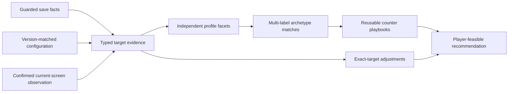

# Target combat-profile evidence boundary

This document defines the evidence boundary selected by
[E5-000](../roadmap/epic-005/BACKLOG.md#e5-000--verify-target-profile-signals-and-select-the-representative-matrix).
It precedes the Epic 5 Domain model: it records which facts may become profile
facets, which sources own them, and which tempting interpretations remain
unsupported.

The supported GameData product version is
`1.0.0+68032f25c1d54dd4fb8fc65b7156e95bf87ec99a`. Every rule in this document
is invalid for a different version until the evidence gate is repeated.

## Decision

Epic 5 starts with four independently matchable playbook families:

1. the existing magic-sound, distraction-mark, mind-resonance, and
   defeat-reset baseline;
2. configured outer-damage pressure on a positively identified active attack;
3. positive, unequal base outer/inner resistance values; and
4. configured poison application on a positively identified active attack.

The new families use exact predicates, not adjectives such as `High` or
`Low`. No percentile, population rank, target-name heuristic, or weapon-label
heuristic is part of the first rule set. A target can match any combination of
these families.

Weapon subtype is retained as descriptive attack context. It never proves a
damage channel, penetration level, defense, poison mechanic, control mechanic,
or counter by itself.

## Evidence pipeline

Configuration explains a known skill or item. It does not establish that the
target currently uses it. Saved equipped membership or applicable current-
screen evidence must first bind the definition to the target.

## Source precedence and completeness

Precedence is field-specific. A later source does not replace unrelated facts.

| Priority | Source | What it may prove | Completeness boundary |
|---:|---|---|---|
| 1 | Confirmed current-screen observation | A visible current skill, direction, typed effect, or complete sparring loadout under the E3-000 rule | Partial panels prove presence only. Complete absence is valid only for a version-matched, complete sparring loadout. |
| 2 | Guarded save, positive equipped membership | That a skill ID occurs in `CombatSkillEquipment.GetValidSkills` for the saved target state | Presence is usable. An empty or missing target loadout is unavailable, not evidence of no skills. |
| 3 | Version-matched `CombatSkillItem` or `WeaponItem` configuration | The typed configured mechanics of an already identified skill or item | Configuration alone never proves target use, current power, live modifiers, or actual combat outcome. |
| 4 | Guarded save, base character calculation | Positive base damage, penetration, resistance, or poison-resistance values returned by standalone-safe base getters | Base values exclude live special-effect modification. Zero is not used to prove absence or a `Low` facet in Epic 5. |
| 5 | Learned-skill dictionary | That a target has a skill record which can resolve a positively equipped ID | Learned membership alone never means equipped, active, or tactically relevant. |
| — | Target/skill name, category, localized label, raw description | Display and explicit confirmation only | Never mechanical evidence. |

When current-screen and saved positive membership disagree, the existing
[target-observation merge](TARGET-LOADOUT-OBSERVATION-MERGE.md) supplies
freshness and conflict semantics. Epic 5 must not introduce a second silent
precedence rule.

## Source-field matrix

`Raw game units` means that the exact stored or returned integer is retained.
No unverified percentage, damage amount, duration, or UI label is assigned to
it.

| Candidate fact | Owning source and member | Runtime type | Unit or normalized meaning | Availability and completeness | Epic 5 decision |
|---|---|---|---|---|---|
| Target identity | Guarded lookup projection | Stable character ID plus localized display text | Identity only | Available when lookup resolves the target; display text may require confirmation | Identity and display only; never a mechanical match input |
| Weapon context | Saved equipment identity joined to `Config.WeaponItem.ItemSubType` | `Int16` code | Versioned weapon subtype code | Positive equipped item presence only; missing equipment is incomplete | Confirmed descriptive attack-family facet; no counter or damage inference |
| Weapon configured attack/defense | `WeaponItem.BaseEquipmentAttack`, `BaseEquipmentDefense` | `Int16` | Raw configured item values | Static definition only; live contribution and scale are not verified | Deferred; not a first-delivery facet |
| Equipped skill membership | `CombatSkillEquipment.GetValidSkills` joined to the target skill dictionary | Set of `Int16` skill IDs | Positive saved membership | Non-empty membership is positive evidence; empty/missing cannot prove absence | Eligible binding evidence |
| Learned skill membership | `DomainManager.CombatSkill.GetCharCombatSkills` | Dictionary keyed by `Int16` skill ID | Learned record presence | Broadly available, including many inactive skills | Resolver input only; rejected as active evidence |
| Attack-skill category | `CombatSkillItem.EquipType` | `SByte` | Exact configured equipment-type code | Available for an identified version-matched skill | May restrict evaluation to configured attack skills; category alone proves no mechanic |
| Discipline/type | `CombatSkillItem.Type` | `SByte` | Exact configured discipline/type code | Available for an identified skill | Context only; names and category labels do not define an archetype |
| Configured outer damage | `CombatSkillItem.OuterDamageSteps` | `Int32[]` | Raw configured outer-damage step entries | Complete for the static skill definition, not live damage | A positive entry on a positively active attack confirms `OUTER_DAMAGE_CONFIGURED` |
| Configured inner damage | `CombatSkillItem.InnerDamageSteps` | `Int32[]` | Raw configured inner-damage step entries | Same boundary as outer damage | Independent supporting fact; outer and inner may both be present |
| Configured mind damage | `CombatSkillItem.MindDamageStep` | `Int32` | Raw configured mind-damage step | Static definition only | Does not replace the exact verified baseline threat/effect rules |
| Configured poison | `CombatSkillItem.Poisons` | `PoisonsAndLevels` fixed values and levels | Presence of one or more non-zero configured poison entries | Complete for static definition; requires positive active-skill binding | Confirms `POISON_APPLICATION_CONFIGURED`; amount, rate, severity, and duration remain unsupported |
| Configured repeated-hit candidate | `CombatSkillItem.TotalHit` | `Int16` | Raw configured integer | Field exists, but production meaning and UI conversion were not verified | Deferred; no repeated-hit facet or threshold |
| Configured penetration candidate | `CombatSkillItem.Penetrate` | `Int16` | Raw configured integer | Static skill definition only; relationship to character/live penetration is not verified | Deferred; no penetration-pressure facet |
| Base outer/inner damage | `Character.CalcBaseDamageSteps()` | `DamageStepCollection` containing `Int32[]` and `Int32` | Raw base character damage-step values | Standalone-safe in the inspected build; excludes live special effects | Discovery/supporting evidence only in the first rule set |
| Base outer/inner penetration | `Character.GetBasePenetrations()` | `OuterAndInnerInts` | Raw base character values | Standalone-safe in the inspected build; positive values only | Deferred until a counter rule needs the exact mechanic |
| Base outer/inner resistance | `Character.GetBasePenetrationResists()` | `OuterAndInnerInts` | Two directly comparable raw base values | Standalone-safe; both values must be positive for the initial asymmetry rule | Unequal positive values confirm `CHANNEL_RESISTANCE_ASYMMETRY`; the larger channel is recorded |
| Base poison resistance | `Character.GetBasePoisonResists()` | `PoisonInts` fixed buffer | Raw base values by poison slot | Standalone-safe, but poison-slot mapping and zero semantics are not yet in the product contract | Deferred |
| Live modified combat values | Non-base character getters such as `GetPenetrations()` and attack-tendency calculation | Runtime-derived values | Would include current special-effect context | Standalone inspection invokes `SpecialEffectDomain.ModifyData` without the required live domain and fails | Explicitly unavailable; never replace with zero or a guessed base value |
| Current-screen active effect | E3-000 labelled combat panel joined to the exact catalogue | Stable skill/effect ID, direction, power evidence | Visible current fact | Partial unless the complete sparring-loadout rule applies | Exact evidence may elevate or conflict with save evidence; visible power remains evidence-only |
| Recovery, avoidance, range, and tempo | Candidate save/configuration/runtime fields | Mixed | Not normalized | Exact live semantics and counter relevance are incomplete | Unsupported for initial matching |

## Initial exact predicates

The first versioned rule set may construct only these new confirmed facets:

### `OUTER_DAMAGE_CONFIGURED`

All conditions are required:

- the target has positive saved equipped membership or applicable current-
  screen evidence for a stable skill ID;
- the exact GameData version resolves that skill as an attack skill; and
- at least one `OuterDamageSteps` entry is greater than zero.

This facet says only that an active attack has configured outer-damage steps.
It does not say `High`, dominant, likely to hit, or more dangerous than another
target. A simultaneous inner-damage facet is allowed.

### `CHANNEL_RESISTANCE_ASYMMETRY`

All conditions are required:

- the guarded saved target returns positive base outer and inner resistance;
- both values come from the same `GetBasePenetrationResists()` call and use the
  same GameData version; and
- the values are unequal.

The facet records which channel has the larger base value and both raw values.
This is an exact within-target comparison, not a population ranking. A zero
value leaves the facet incomplete in the initial rule set.

### `POISON_APPLICATION_CONFIGURED`

All conditions are required:

- the target has positive saved equipped membership or applicable current-
  screen evidence for a stable attack-skill ID;
- the exact GameData definition exposes a non-zero configured poison entry;
  and
- no fresher exact-target evidence contradicts the binding.

This facet records configured poison presence only. It does not infer poison
type from a name, or claim application rate, stack count, duration, severity,
or resistance interaction.

### Existing mind/reset baseline

The baseline is not reconstructed from generic `MindDamageStep` values. It
continues to use the versioned threat, effect, direction, and reset evidence in
[TARGET-THREAT-TAXONOMY.md](TARGET-THREAT-TAXONOMY.md),
[COMBAT-EFFECT-CATALOG.md](COMBAT-EFFECT-CATALOG.md), and
[COMBAT-COUNTER-RULES.md](COMBAT-COUNTER-RULES.md).

## Threshold policy

Epic 5 version 1 proposes no `High` or `Low` facet. Therefore it has no target
population, percentile threshold, or UI adjective to normalize.

The three new predicates are exact mechanics:

| Predicate | Exact rule | Comparison population |
|---|---|---|
| Outer-damage configured | Any positive configured outer-damage step on a positively identified active attack | None |
| Channel-resistance asymmetry | Both base channel values are positive and unequal | The two same-unit values on the same target, not a target population |
| Poison application configured | Any non-zero configured poison entry on a positively identified active attack | None |

Discovery rankings are useful only for selecting varied verification cases.
They must never leak into Domain rules. A later `High` or `Low` proposal needs
a new evidence version documenting its population, normalization, boundary
behavior, and invalidation policy.

## Evidence and conflict rules

- Missing evidence constructs `Incomplete` or `Unsupported`, never a zero
  value or negative match.
- A positive saved equipped skill may establish presence. A missing saved list
  cannot establish absence.
- A complete, newer E3-000 sparring observation may establish both presence
  and absence for the current displayed loadout. A partial battle panel may
  establish presence only.
- Static configuration may enrich an identified active skill. It cannot make a
  learned-only skill active.
- Base values and live modified values are different facts. Epic 5 exposes the
  base provenance and never labels it `current live`.
- Conflicting applicable evidence remains visible and produces a conflicting
  facet or match; it is not resolved through source-name order.
- A version mismatch makes every rule in this document unsupported.

## Safety boundary

All save access remains inside the existing fingerprinted archive session.
Installed configuration and language sources are opened read-only and guarded
before and after local verification. The profile model introduces no process
attachment, hook, injection, memory read, game command, screenshot capture,
OCR, file upload, or persistence.

The E5-000 standalone inspection found that apparently passive live getters
can enter `SpecialEffectDomain.ModifyData` and require a live domain context.
Those getters are prohibited from the standalone reader. Only specifically
verified base getters may be considered, and their result provenance must say
`base` explicitly.

## Versioning and invalidation

A profile rule identity must include:

- the exact GameData product version;
- the profile-rule version;
- every static definition identity consumed by the rule;
- the save or observation provenance used to bind facts to the target; and
- the applicable E3-000 observation-rule identity when screen evidence is
  consumed.

Changing any item invalidates cached or compared profile results. Machine-
specific paths, timestamps that do not change semantics, localized display
text, and file hashes must not enter a stable profile identity, although
source hashes remain verification and freshness metadata.

Representative evidence and the sanitized delivery matrix are recorded in
[E5-000 target-archetype evidence](../scenarios/E5-000-target-archetype-evidence.md).
