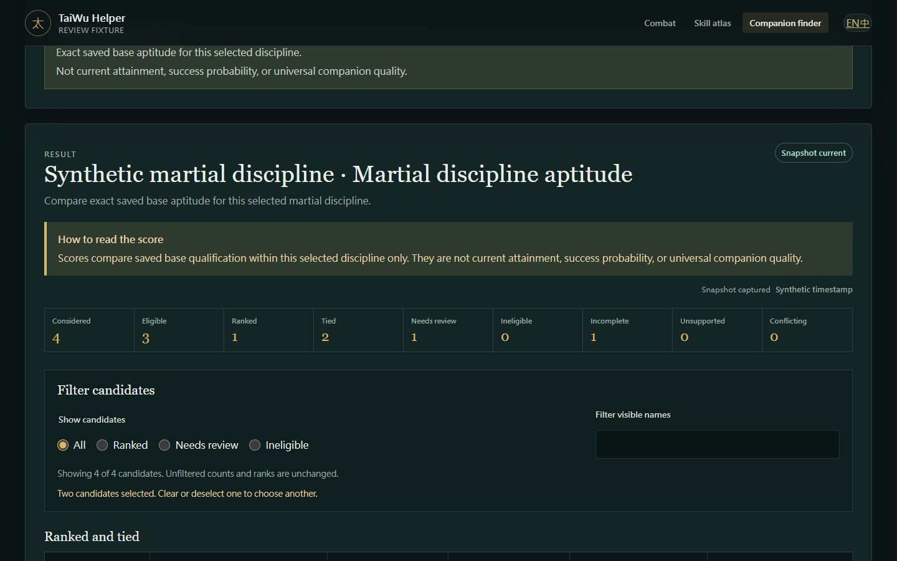
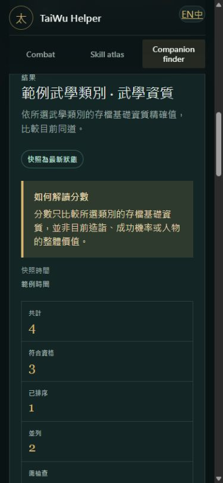
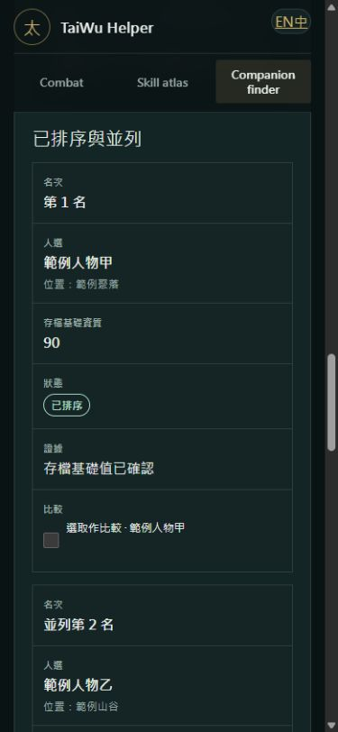

# E6-010 companion finder UI verification

| Field | Value |
|---|---|
| Status | Complete |
| Evidence date | 2026-08-17 |
| Epic | [EPIC-006](../roadmap/epic-006/EPIC.md) |
| Backlog item | [E6-010](../roadmap/epic-006/BACKLOG.md#e6-010--deliver-the-bilingual-accessible-companion-finder-ui) |
| UI contract | [UI-006](../roadmap/epic-006/UI-006-companion-candidate-finder.md) |

## Scope and data hygiene

The live localhost `/companions` route was inspected only before its explicit
save-reading action. The route loaded installed bilingual discipline labels but
did not read or display candidate save content. The result review used the
committed [synthetic fixture](./fixtures/E6-010-companion-finder.html), whose
banner states that every name, location, value, timestamp, and rank is
invented.

No real character identity, candidate value, save fingerprint, source
fingerprint, proprietary source text, or local machine path is present in this
report or its captures.

> **Closure correction:** the PNG captures below predate the independent E6-012
> reviews and retain the former rankability-based eligible tile plus the former
> living-only boundary wording. They remain historical layout evidence only.
> The corrected synthetic fixture reports all four candidate-universe-eligible
> profiles and describes the full saved non-Taiwu roster universe, while current
> mapper and Razor rendering tests prove exact eligibility, evaluation/gate
> semantics, and typed partial/catalogue states.

## Live route verification

The live page returned its expected title and `/companions` route. Its initial
accessibility snapshot exposed:

- skip link, banner, primary navigation, language group, and main landmark;
- information-only and candidate-universe-boundary notes;
- one labelled role-family group with two native radios;
- one native labelled discipline select; and
- one disabled native Find button with visible enabling guidance.

Selecting the martial role did not read the save. It enabled the select and
showed the 14 installed localized martial disciplines in stable type order,
with raw type indexes absent from visible labels. The browser console recorded
no errors. At the live page's 1,280-pixel viewport, document scroll and client
widths were equal, so the initial route introduced no whole-page horizontal
overflow.

## Synthetic English desktop result

At 1,440 by 900 CSS pixels, the result shell used wide semantic tables and
showed the selected role, discipline, current-snapshot label, exact score
limitation, all nine unfiltered counts, filters, tied rows, unavailable state,
and two-candidate comparison without a universal-quality claim.

The inspected synthetic document contained six native radios, four native
comparison checkboxes, three semantic tables, and the expected heading order.
Its document scroll width equalled its client width. Visible tie text and an
accessible shared-rank label supplemented the numeric competition rank.

## Synthetic Traditional Chinese narrow result

At 390 by 844 CSS pixels, the content viewport was 375 pixels and both
`scrollWidth` and `clientWidth` were 375. The same result used the accepted
Traditional Chinese terminology, retained the score warning and all counts,
and exposed 30 mobile fact labels from the same DOM tables. No duplicated
desktop/mobile candidate tree was introduced.

The candidate section reflowed each table row into a heading-led card. Rank,
candidate, location, saved base qualification, explicit state, evidence, and
comparison control remained visible in their original DOM order; long labels
wrapped without widening the document.

## Interaction and state guarantees

Automated Presentation tests exercise loading, cancellation, configured-save
absence, changed revision, unsupported source, partial, empty, ranked, tied,
ineligible, incomplete, unsupported, stale, and conflicting states. They also
prove that filters preserve unfiltered counts and ranks, two selections use the
existing immutable shortlist, unavailable comparison values have no numeric
difference, and language remapping preserves stable identities.

Rendered semantic tests verify native controls, scoped headers, accessible
names, live regions, focus targets, visible non-color cues, previous-result
inertness, complete bilingual copy, responsive single-DOM classes, and raw-ID
hiding. Architecture checks forbid a Presentation evaluation path and any
save-write, persistence, process, screenshot, upload, input-automation, or
game-control dependency.

The closure correction additionally renders the production Razor result for
every supported snapshot/enrichment/catalogue state and checks distinct
bilingual recovery guidance. It also proves that universe eligibility remains
independent of rankability in both API and Presentation summaries.

## Automated result

The final non-integration matrix passed 1,221 tests:

| Project | Passed |
|---|---:|
| Domain | 491 |
| Application | 178 |
| Infrastructure | 145 |
| Architecture | 93 |
| API and Presentation | 314 |

The complete solution build passed with zero warnings and zero errors.
Formatter verification, Markdown link validation, leak/safety scans, and
`git diff --check` also passed before the backlog commit.

## Conclusion

E6-010 satisfies the accepted UI contract. The page is bilingual,
keyboard-native, evidence-preserving, responsive without fact duplication,
and information-only. It delegates the only save read to the existing
Application use case and does not introduce a second evaluation or mutation
path.
